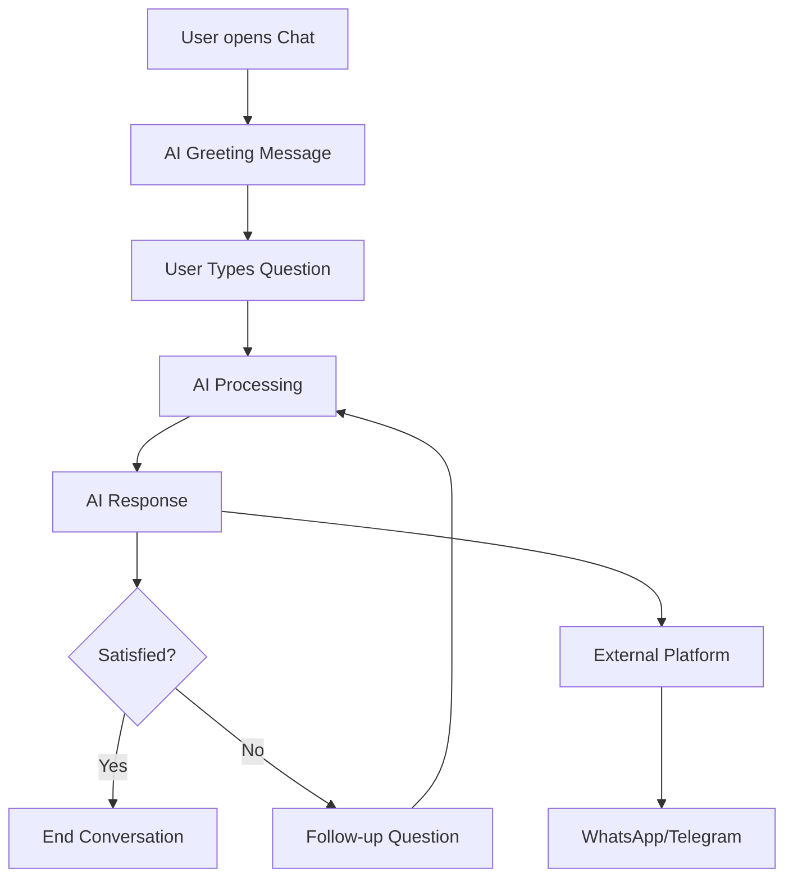
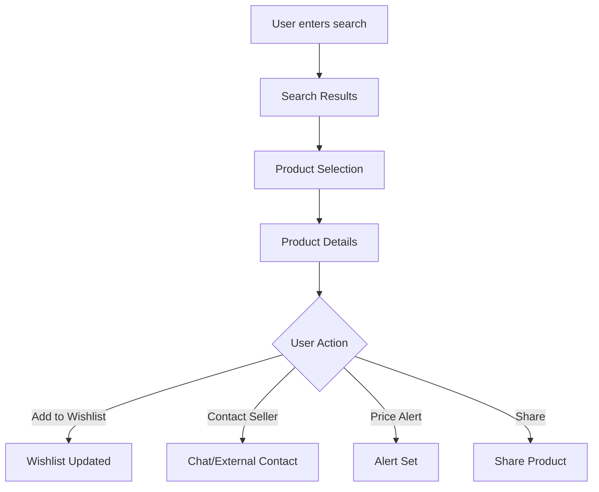
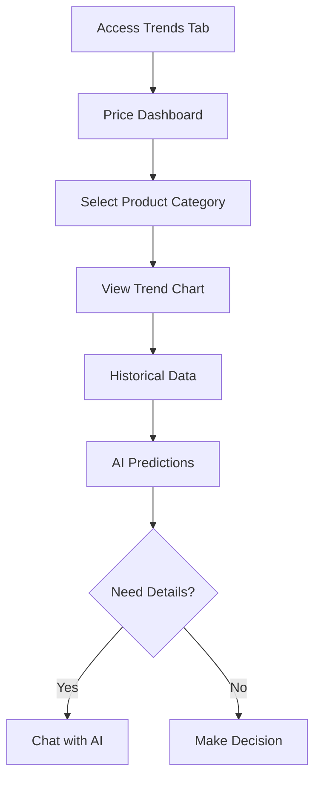

# User Flow & Information Architecture

## Overview
Dokumentasi lengkap tentang user journey, information architecture, dan interaction flows untuk aplikasi Pasar Digital AI.

## User Personas

### Primary Persona: Pedagang Pasar Tradisional
- **Name**: Budi Santoso (45 tahun)
- **Role**: Pedagang sayuran di Pasar Malang
- **Tech Level**: Menengah (menggunakan smartphone daily)
- **Goals**: 
  - Mendapat insight harga pasar real-time
  - Terhubung dengan supplier dan pembeli
  - Mengoptimalkan stok dan pricing
- **Pain Points**:
  - Sulit prediksi harga dan demand
  - Informasi pasar tersebar dan tidak akurat
  - Komunikasi dengan network terbatas

### Secondary Persona: Pembeli Reguler
- **Name**: Sari Dewi (32 tahun)
- **Role**: Ibu rumah tangga yang rutin belanja ke pasar
- **Tech Level**: Tinggi (comfortable dengan apps)
- **Goals**:
  - Menemukan produk terbaik dengan harga fair
  - Mendapat rekomendasi dari AI
  - Membangun relationship dengan penjual terpercaya
- **Pain Points**:
  - Harga berfluktuasi dan sulit diprediksi
  - Kualitas produk tidak konsisten
  - Waktu terbatas untuk survey harga

## Information Architecture

### Site Map
```
Pasar Digital AI
├── Authentication
│   ├── Login
│   └── Register
├── Home Dashboard
│   ├── Search
│   ├── AI Assistant Quick Access
│   ├── Trending Products
│   ├── News Feed
│   └── Quick Actions
├── Market Trends
│   ├── Price Analytics
│   ├── Historical Data
│   ├── Prediction Charts
│   └── Market Reports
├── AI Chat Assistant
│   ├── Chat Interface
│   ├── Voice Input (future)
│   ├── External Platform Integration
│   │   ├── WhatsApp
│   │   └── Telegram
│   └── Chat History
├── Recommendations
│   ├── Product Recommendations
│   ├── Store Recommendations
│   ├── Price Alerts
│   └── Personalized Feed
└── User Profile
    ├── Personal Information
    ├── Shopping Lists & To-Do
    ├── Favorite Stores
    ├── Product Wishlist
    ├── Social Connections
    └── Settings
        ├── Account Settings
        ├── Privacy Controls
        ├── Notification Preferences
        ├── AI Assistant Settings
        └── App Preferences
```

## User Journey Maps

### Journey 1: First-Time User Onboarding
```
1. App Discovery → 2. Download → 3. Registration → 4. Profile Setup → 5. Tutorial → 6. First Search → 7. AI Interaction → 8. Value Realization
```

**Detailed Steps:**
1. **App Discovery**: User discovers app through word-of-mouth atau play store
2. **Download & Install**: Downloads app, opens for first time
3. **Registration**: Creates account dengan email atau phone number
4. **Profile Setup**: Enters basic information, role (pedagang/pembeli)
5. **Feature Tutorial**: Interactive walkthrough of main features
6. **First Search**: Searches for familiar product atau store
7. **AI Interaction**: First conversation dengan AI assistant
8. **Value Realization**: Understands app value proposition

**Touchpoints:**
- Play Store listing
- Login screen
- Welcome tutorial
- AI assistant introduction
- First product search results

### Journey 2: Daily Market Check (Pedagang)
```
1. Morning Login → 2. Price Dashboard → 3. Trend Analysis → 4. AI Consultation → 5. Pricing Decision → 6. Stock Planning
```

**Detailed Steps:**
1. **Morning Login**: Opens app untuk daily market check
2. **Price Dashboard**: Reviews current prices untuk products
3. **Trend Analysis**: Checks price trends dan predictions
4. **AI Consultation**: Asks AI about market conditions
5. **Pricing Decision**: Sets prices based on insights
6. **Stock Planning**: Plans inventory untuk the day

**Key Features Used:**
- Home dashboard
- Trending products section
- AI chat assistant
- Price analytics
- Market predictions

### Journey 3: Shopping Planning (Pembeli)
```
1. Shopping List Creation → 2. Price Research → 3. Store Comparison → 4. AI Recommendations → 5. Store Selection → 6. Purchase Planning
```

**Detailed Steps:**
1. **Shopping List**: Creates atau updates shopping list
2. **Price Research**: Checks current prices for items
3. **Store Comparison**: Compares prices across different stores
4. **AI Recommendations**: Gets AI suggestions untuk best deals
5. **Store Selection**: Chooses stores untuk visit
6. **Purchase Planning**: Plans shopping route dan timing

## Interaction Flows

### Flow 1: AI Assistant Interaction


### Flow 2: Product Search & Discovery


### Flow 3: Market Trend Analysis


## Navigation Patterns

### Primary Navigation (Bottom Tabs)
1. **Home**: Main dashboard dan entry point
2. **Trends**: Market analysis dan price tracking
3. **Chat**: AI assistant dan communication hub
4. **Recommendations**: Personalized content
5. **Profile**: User management dan settings

### Secondary Navigation
- **Header Actions**: Search, notifications, quick access
- **Card Actions**: CTAs dalam cards untuk specific features
- **Deep Links**: Direct access ke specific content
- **Contextual Menus**: Action sheets untuk item-specific actions

### Navigation Hierarchy
```
Level 1: Bottom Navigation (Always Visible)
├── Level 2: Feature Categories (Screen Headers)
    ├── Level 3: Content Sections (Within Screen)
        └── Level 4: Detail Views (Modal/New Screen)
```

## State Management

### App States
1. **Loading States**: Skeleton screens, spinners
2. **Empty States**: No data scenarios dengan helpful actions
3. **Error States**: Network errors, API failures dengan retry options
4. **Success States**: Confirmation messages, completed actions

### User States
1. **Unauthenticated**: Login/register screens
2. **New User**: Onboarding flow, tutorials
3. **Active User**: Full feature access
4. **Offline**: Limited functionality, cached content

### Data States
1. **Fresh Data**: Recently fetched, up-to-date
2. **Stale Data**: Older data, needs refresh
3. **Cached Data**: Offline available content
4. **No Data**: Empty states, initial load

## Content Strategy

### Content Types
1. **User-Generated**: Reviews, lists, social interactions
2. **AI-Generated**: Predictions, recommendations, insights
3. **External Data**: RSS feeds, market data, news
4. **System Content**: Notifications, status messages

### Content Hierarchy
1. **Primary**: Essential information user needs immediately
2. **Secondary**: Supporting information, context
3. **Tertiary**: Nice-to-have, additional details
4. **Metadata**: Timestamps, sources, technical info

### Localization Considerations
- **Language**: Bahasa Indonesia primary, English fallback
- **Currency**: Rupiah formatting
- **Cultural Context**: Local market terminology
- **Regional Data**: Location-specific content

## Error Handling & Edge Cases

### Common Error Scenarios
1. **Network Connectivity**: Offline mode, retry mechanisms
2. **API Failures**: Graceful degradation, fallback content
3. **Invalid Input**: Clear error messages, input validation
4. **Permission Denied**: Clear explanations, alternative actions

### Edge Cases
1. **Empty Search Results**: Suggestions, typo correction
2. **Outdated Data**: Clear indicators, refresh options
3. **Feature Unavailable**: Coming soon messages, alternatives
4. **Account Issues**: Support contact, troubleshooting

## Analytics & Metrics

### Key Performance Indicators (KPIs)
1. **User Engagement**: Daily/monthly active users
2. **Feature Adoption**: AI chat usage, search frequency
3. **Conversion**: Registration rate, feature completion
4. **Retention**: User return rate, session duration

### User Behavior Tracking
1. **Navigation Patterns**: Most used screens, navigation paths
2. **Search Behavior**: Popular queries, search success rate
3. **AI Interaction**: Chat frequency, satisfaction ratings
4. **Content Engagement**: Most viewed content, sharing rates

### Business Metrics
1. **Market Impact**: Price accuracy, prediction success
2. **Community Growth**: User connections, network effects
3. **Platform Integration**: External platform usage
4. **User Satisfaction**: App store ratings, feedback
