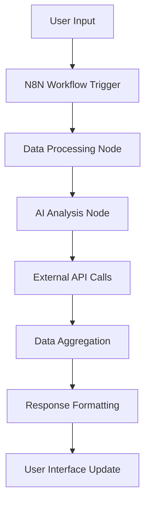
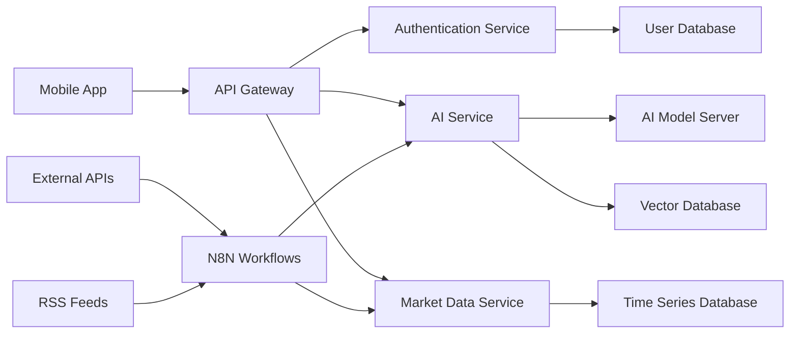
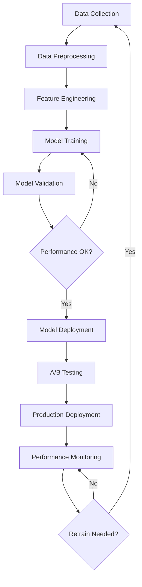
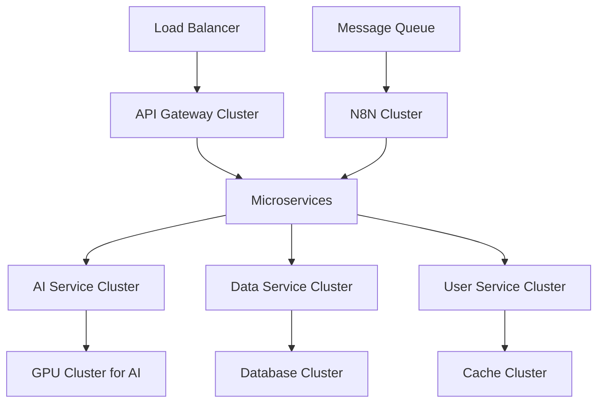

# AI Integration & Technical Specifications

## Overview
Dokumentasi teknis tentang integrasi AI assistant, N8N workflows, external APIs, dan arsitektur backend untuk aplikasi Pasar Digital AI.

## AI Assistant Architecture

### Core AI Components

#### 1. Natural Language Processing (NLP)
- **Language Models**: GPT-4 atau equivalent untuk conversation
- **Intent Recognition**: Understanding user queries dan requests
- **Entity Extraction**: Product names, prices, locations
- **Sentiment Analysis**: User satisfaction dan mood detection
- **Language Support**: Bahasa Indonesia primary, multilingual capability

#### 2. Machine Learning Models
- **Price Prediction**: Time series forecasting untuk market prices
- **Demand Forecasting**: Product demand based on historical patterns
- **Recommendation Engine**: Collaborative filtering + content-based
- **Market Trend Analysis**: Pattern recognition dalam price movements
- **Quality Assessment**: Product quality prediction based on reviews

#### 3. AI Assistant Capabilities
```javascript
const aiCapabilities = {
  marketAnalysis: {
    priceForecasting: 'Real-time price predictions',
    trendAnalysis: 'Market trend identification',
    demandPrediction: 'Product demand forecasting',
    seasonalityDetection: 'Seasonal pattern recognition'
  },
  productRecommendations: {
    personalizedSuggestions: 'User behavior-based recommendations',
    qualityMatching: 'Quality preference matching',
    priceOptimization: 'Best price recommendations',
    substituteFinding: 'Alternative product suggestions'
  },
  conversationalAI: {
    naturalLanguage: 'Human-like conversation',
    contextAwareness: 'Conversation context retention',
    multiTurnDialogue: 'Complex conversation handling',
    emotionalIntelligence: 'Empathetic responses'
  },
  businessIntelligence: {
    marketInsights: 'Market condition analysis',
    competitorAnalysis: 'Price comparison insights',
    inventoryOptimization: 'Stock management suggestions',
    salesStrategy: 'Revenue optimization advice'
  }
};
```

## N8N Workflow Integration

### Workflow Architecture


### Core Workflows

#### 1. Market Data Collection Workflow
```json
{
  "name": "Market Data Collection",
  "nodes": [
    {
      "name": "Schedule Trigger",
      "type": "cron",
      "schedule": "0 */6 * * *"
    },
    {
      "name": "RSS Feed Reader",
      "type": "rss",
      "sources": ["market-news.com", "ekonomi.com"]
    },
    {
      "name": "Price API Fetcher",
      "type": "http",
      "endpoints": ["price-api", "market-data-api"]
    },
    {
      "name": "Data Cleaner",
      "type": "function",
      "operation": "cleanAndValidateData"
    },
    {
      "name": "Database Insert",
      "type": "postgres",
      "operation": "INSERT"
    }
  ]
}
```

#### 2. AI Response Generation Workflow
```json
{
  "name": "AI Response Generation",
  "nodes": [
    {
      "name": "Webhook Trigger",
      "type": "webhook",
      "endpoint": "/api/ai-chat"
    },
    {
      "name": "Context Retrieval",
      "type": "database",
      "operation": "getUserContext"
    },
    {
      "name": "AI Model Call",
      "type": "openai",
      "model": "gpt-4",
      "temperature": 0.7
    },
    {
      "name": "Response Formatter",
      "type": "function",
      "operation": "formatAIResponse"
    },
    {
      "name": "Response Delivery",
      "type": "webhook",
      "method": "POST"
    }
  ]
}
```

#### 3. Price Alert Workflow
```json
{
  "name": "Price Alert System",
  "nodes": [
    {
      "name": "Price Monitor",
      "type": "cron",
      "schedule": "*/15 * * * *"
    },
    {
      "name": "Threshold Checker",
      "type": "function",
      "operation": "checkPriceThresholds"
    },
    {
      "name": "Alert Generator",
      "type": "conditional",
      "condition": "priceChangeExceedsThreshold"
    },
    {
      "name": "Multi-channel Notifier",
      "type": "parallel",
      "channels": ["push", "whatsapp", "telegram"]
    }
  ]
}
```

## External API Integrations

### Market Data APIs
```javascript
const marketDataAPIs = {
  priceData: {
    endpoint: 'https://api.marketdata.com/prices',
    authentication: 'API_KEY',
    rateLimit: '1000 requests/hour',
    dataFormat: 'JSON',
    updateFrequency: 'Real-time'
  },
  weatherAPI: {
    endpoint: 'https://api.weather.com/forecast',
    purpose: 'Agricultural impact prediction',
    authentication: 'Bearer Token',
    coverage: 'Indonesia region'
  },
  newsAPI: {
    endpoint: 'https://api.news.com/market',
    purpose: 'Market sentiment analysis',
    sources: ['detik.com', 'kompas.com', 'tempo.co'],
    language: 'Indonesian'
  },
  economicData: {
    endpoint: 'https://api.bps.go.id/inflation',
    purpose: 'Economic indicators',
    dataSource: 'Bank Indonesia, BPS',
    updateFrequency: 'Monthly'
  }
};
```

### Social Platform Integration
```javascript
const socialIntegrations = {
  whatsapp: {
    api: 'WhatsApp Business API',
    features: ['send messages', 'receive messages', 'media sharing'],
    authentication: 'Facebook App ID',
    webhook: 'https://api.ourapp.com/whatsapp-webhook'
  },
  telegram: {
    api: 'Telegram Bot API',
    features: ['bot commands', 'inline keyboards', 'file sharing'],
    authentication: 'Bot Token',
    webhook: 'https://api.ourapp.com/telegram-webhook'
  },
  sms: {
    provider: 'Twilio',
    purpose: 'Backup notifications',
    features: ['alerts', 'verification codes'],
    coverage: 'Indonesia mobile networks'
  }
};
```

## Data Architecture

### Database Schema
```sql
-- Users table
CREATE TABLE users (
  id SERIAL PRIMARY KEY,
  username VARCHAR(50) UNIQUE NOT NULL,
  email VARCHAR(100) UNIQUE NOT NULL,
  phone VARCHAR(15),
  role ENUM('buyer', 'seller', 'admin'),
  location VARCHAR(100),
  created_at TIMESTAMP DEFAULT CURRENT_TIMESTAMP,
  updated_at TIMESTAMP DEFAULT CURRENT_TIMESTAMP
);

-- Products table
CREATE TABLE products (
  id SERIAL PRIMARY KEY,
  name VARCHAR(100) NOT NULL,
  category VARCHAR(50),
  unit VARCHAR(20),
  description TEXT,
  image_url VARCHAR(255),
  created_at TIMESTAMP DEFAULT CURRENT_TIMESTAMP
);

-- Price history table
CREATE TABLE price_history (
  id SERIAL PRIMARY KEY,
  product_id INTEGER REFERENCES products(id),
  price DECIMAL(10,2) NOT NULL,
  location VARCHAR(100),
  source VARCHAR(50),
  recorded_at TIMESTAMP DEFAULT CURRENT_TIMESTAMP
);

-- AI conversations table
CREATE TABLE ai_conversations (
  id SERIAL PRIMARY KEY,
  user_id INTEGER REFERENCES users(id),
  message TEXT NOT NULL,
  response TEXT NOT NULL,
  intent VARCHAR(50),
  confidence DECIMAL(3,2),
  created_at TIMESTAMP DEFAULT CURRENT_TIMESTAMP
);

-- User preferences table
CREATE TABLE user_preferences (
  id SERIAL PRIMARY KEY,
  user_id INTEGER REFERENCES users(id),
  preference_type VARCHAR(50),
  preference_value TEXT,
  created_at TIMESTAMP DEFAULT CURRENT_TIMESTAMP
);
```

### Data Flow Architecture


## AI Model Training & Management

### Training Data Sources
```javascript
const trainingDataSources = {
  historicalPrices: {
    source: 'Market data APIs',
    timeframe: '5 years historical data',
    granularity: 'Hourly price points',
    coverage: 'Major Indonesian markets'
  },
  weatherPatterns: {
    source: 'BMKG, Weather APIs',
    purpose: 'Agricultural impact modeling',
    parameters: ['temperature', 'rainfall', 'humidity'],
    resolution: 'City-level data'
  },
  userInteractions: {
    source: 'App usage analytics',
    dataTypes: ['search queries', 'purchase patterns', 'preferences'],
    privacy: 'Anonymized and aggregated',
    purpose: 'Personalization models'
  },
  newsData: {
    source: 'RSS feeds, news APIs',
    processing: 'NLP sentiment analysis',
    languages: ['Indonesian', 'English'],
    categories: ['economy', 'agriculture', 'market news']
  }
};
```

### Model Deployment Pipeline


### Model Performance Metrics
```javascript
const modelMetrics = {
  pricePrediction: {
    accuracy: 'MAPE < 10%',
    precision: 'Price range accuracy',
    recall: 'Trend direction accuracy',
    f1Score: 'Overall prediction quality'
  },
  recommendationEngine: {
    clickThroughRate: 'User engagement with recommendations',
    conversionRate: 'Purchase rate from recommendations',
    diversity: 'Recommendation variety score',
    novelty: 'New product discovery rate'
  },
  conversationalAI: {
    intentAccuracy: 'Correct intent recognition',
    responseRelevance: 'User satisfaction rating',
    conversationLength: 'Average turns per conversation',
    resolutionRate: 'Successful query resolution'
  }
};
```

## Security & Privacy

### Data Protection
```javascript
const securityMeasures = {
  dataEncryption: {
    inTransit: 'TLS 1.3 encryption',
    atRest: 'AES-256 encryption',
    keyManagement: 'AWS KMS / Azure Key Vault'
  },
  authentication: {
    userAuth: 'JWT tokens with refresh mechanism',
    apiAuth: 'OAuth 2.0 + API keys',
    mfa: 'SMS/TOTP two-factor authentication'
  },
  privacy: {
    dataMinimization: 'Collect only necessary data',
    anonymization: 'Personal data anonymization',
    rightToDelete: 'GDPR-compliant data deletion',
    consentManagement: 'Granular privacy controls'
  },
  compliance: {
    standards: ['GDPR', 'Indonesia Privacy Law'],
    auditing: 'Regular security audits',
    monitoring: '24/7 security monitoring',
    backups: 'Encrypted daily backups'
  }
};
```

## Performance Optimization

### Caching Strategy
```javascript
const cachingLayers = {
  applicationLevel: {
    userSessions: 'Redis cache for user sessions',
    frequentQueries: 'In-memory cache for common requests',
    staticContent: 'CDN for images and static assets'
  },
  databaseLevel: {
    queryCache: 'Database query result caching',
    connectionPooling: 'Optimized database connections',
    indexing: 'Strategic database indexing'
  },
  aiModelLevel: {
    modelCache: 'Cached model predictions',
    embeddingCache: 'Vector embeddings cache',
    responseCache: 'Common AI response caching'
  }
};
```

### Scalability Architecture


## Monitoring & Analytics

### System Monitoring
```javascript
const monitoringMetrics = {
  performance: {
    responseTime: 'API response times',
    throughput: 'Requests per second',
    errorRate: 'Error percentage',
    uptime: 'Service availability'
  },
  aiMetrics: {
    modelLatency: 'AI response time',
    accuracy: 'Prediction accuracy',
    userSatisfaction: 'AI interaction ratings',
    usagePatterns: 'Feature usage analytics'
  },
  businessMetrics: {
    userEngagement: 'Daily/monthly active users',
    featureAdoption: 'New feature usage rates',
    retentionRate: 'User retention over time',
    conversionFunnel: 'User journey completion'
  }
};
```

### Error Handling & Logging
```javascript
const errorHandling = {
  logging: {
    level: 'INFO/WARN/ERROR/DEBUG',
    structure: 'Structured JSON logging',
    correlation: 'Request correlation IDs',
    retention: '30 days log retention'
  },
  alerting: {
    channels: ['Slack', 'PagerDuty', 'Email'],
    thresholds: 'Custom alert thresholds',
    escalation: 'Escalation procedures',
    autoRecovery: 'Automated recovery procedures'
  },
  fallbacks: {
    aiFailure: 'Fallback to cached responses',
    apiFailure: 'Graceful degradation',
    networkIssues: 'Offline mode capabilities',
    dataUnavailable: 'Default content display'
  }
};
```
