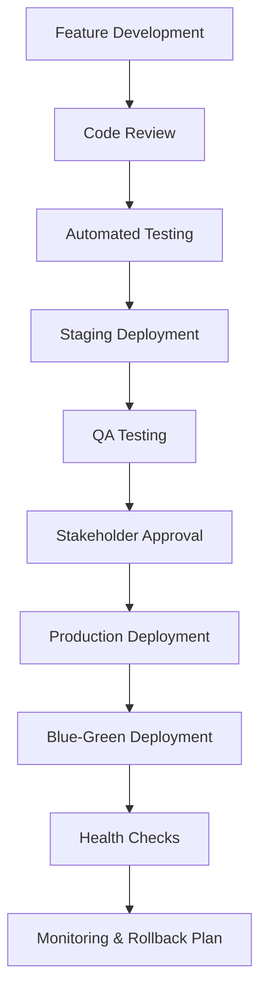

# Implementation Roadmap & Development Guide

## Overview
Panduan lengkap untuk implementasi aplikasi Pasar Digital AI, mencakup fase development, timeline, resources yang dibutuhkan, dan strategi deployment.

## Development Phases

### Phase 1: Foundation & Core Features (Month 1-3)
**Duration**: 12 weeks
**Priority**: High

#### Week 1-2: Project Setup & Architecture
- [ ] Development environment setup
- [ ] CI/CD pipeline configuration
- [ ] Database schema design dan implementation
- [ ] API architecture planning
- [ ] Authentication system setup
- [ ] Basic UI component library

#### Week 3-4: User Authentication & Basic UI
- [ ] Login/Register functionality
- [ ] User profile management
- [ ] Basic navigation structure
- [ ] Home screen layout
- [ ] Bottom navigation implementation
- [ ] Basic design system components

#### Week 5-8: Core Data Features
- [ ] Product database integration
- [ ] Price data collection system
- [ ] Basic search functionality
- [ ] Product listing dan display
- [ ] Trending products feature
- [ ] RSS feed integration for news

#### Week 9-12: Basic AI Integration
- [ ] Simple chatbot implementation
- [ ] Basic N8N workflow setup
- [ ] Price prediction model (basic version)
- [ ] AI assistant conversation flow
- [ ] External API integrations (weather, news)
- [ ] Basic recommendation engine

**Deliverables:**
- Functional mobile app dengan core features
- User authentication dan profile management
- Basic AI assistant
- Market data integration
- News feed functionality

### Phase 2: Advanced AI & Analytics (Month 4-6)
**Duration**: 12 weeks
**Priority**: High

#### Week 13-16: Enhanced AI Capabilities
- [ ] Advanced NLP model integration
- [ ] Conversation context management
- [ ] Intent recognition improvement
- [ ] Sentiment analysis implementation
- [ ] Multi-turn conversation support
- [ ] AI response quality optimization

#### Week 17-20: Market Analytics & Predictions
- [ ] Advanced price prediction models
- [ ] Market trend analysis algorithms
- [ ] Historical data visualization
- [ ] Predictive analytics dashboard
- [ ] Custom alerts system
- [ ] Business intelligence features

#### Week 21-24: Social Features & Integration
- [ ] WhatsApp integration
- [ ] Telegram bot development
- [ ] User following/follower system
- [ ] Social recommendations
- [ ] Community features
- [ ] Sharing functionality

**Deliverables:**
- Advanced AI assistant dengan complex conversation
- Predictive analytics dan market insights
- Social platform integrations
- Enhanced user experience

### Phase 3: Optimization & Advanced Features (Month 7-9)
**Duration**: 12 weeks
**Priority**: Medium

#### Week 25-28: Performance Optimization
- [ ] App performance optimization
- [ ] Database query optimization
- [ ] Caching implementation
- [ ] Image optimization
- [ ] Network request optimization
- [ ] Loading time improvements

#### Week 29-32: Advanced User Features
- [ ] Personalized recommendations
- [ ] Advanced search filters
- [ ] Wishlist management
- [ ] Shopping list functionality
- [ ] Store favorites system
- [ ] Price comparison tools

#### Week 33-36: Business Features
- [ ] Seller dashboard (if applicable)
- [ ] Inventory management tools
- [ ] Sales analytics
- [ ] Revenue optimization features
- [ ] Business intelligence reports
- [ ] Market insights for sellers

**Deliverables:**
- Optimized app performance
- Advanced user management features
- Business intelligence tools
- Enhanced personalization

### Phase 4: Scale & Enterprise Features (Month 10-12)
**Duration**: 12 weeks
**Priority**: Low-Medium

#### Week 37-40: Scalability Improvements
- [ ] Microservices architecture
- [ ] Load balancing implementation
- [ ] Database clustering
- [ ] Auto-scaling setup
- [ ] Performance monitoring
- [ ] Error tracking dan alerting

#### Week 41-44: Enterprise Features
- [ ] Admin dashboard
- [ ] Analytics dashboard
- [ ] User management tools
- [ ] Content management system
- [ ] Moderation tools
- [ ] Reporting system

#### Week 45-48: Advanced Integrations
- [ ] Payment system integration
- [ ] E-commerce features
- [ ] Third-party marketplace integration
- [ ] Advanced APIs
- [ ] Partner integrations
- [ ] White-label solutions

**Deliverables:**
- Scalable enterprise-ready platform
- Comprehensive admin tools
- Advanced integrations
- Full-featured marketplace

## Technology Stack

### Frontend Development
```javascript
const frontendStack = {
  framework: 'React Native',
  stateManagement: 'Redux Toolkit / Zustand',
  navigation: 'React Navigation v6',
  uiLibrary: 'React Native Elements / NativeBase',
  styling: 'Styled Components / Tailwind CSS',
  icons: 'React Native Vector Icons',
  animations: 'React Native Reanimated',
  testing: 'Jest + React Native Testing Library'
};
```

### Backend Development
```javascript
const backendStack = {
  runtime: 'Node.js',
  framework: 'Express.js / Fastify',
  database: {
    primary: 'PostgreSQL',
    cache: 'Redis',
    timeSeries: 'InfluxDB',
    search: 'Elasticsearch'
  },
  ai: {
    nlp: 'OpenAI GPT-4 / Anthropic Claude',
    ml: 'TensorFlow / PyTorch',
    vector: 'Pinecone / Weaviate'
  },
  automation: 'N8N',
  authentication: 'JWT + OAuth2',
  fileStorage: 'AWS S3 / Cloudinary',
  monitoring: 'Prometheus + Grafana'
};
```

### Infrastructure & DevOps
```javascript
const infrastructureStack = {
  cloud: 'AWS / Google Cloud / Azure',
  containerization: 'Docker + Kubernetes',
  cicd: 'GitHub Actions / GitLab CI',
  loadBalancer: 'Nginx / AWS ALB',
  cdn: 'CloudFront / Cloudflare',
  monitoring: {
    apm: 'New Relic / DataDog',
    logging: 'ELK Stack',
    alerting: 'PagerDuty / Slack'
  },
  security: 'AWS WAF + Security Groups'
};
```

## Resource Requirements

### Development Team Structure
```javascript
const teamStructure = {
  projectManager: {
    count: 1,
    responsibilities: ['Project planning', 'Timeline management', 'Stakeholder communication']
  },
  frontendDevelopers: {
    count: 2,
    skills: ['React Native', 'JavaScript/TypeScript', 'UI/UX implementation']
  },
  backendDevelopers: {
    count: 2,
    skills: ['Node.js', 'Database design', 'API development', 'DevOps']
  },
  aiEngineer: {
    count: 1,
    skills: ['Machine Learning', 'NLP', 'Python', 'Model deployment']
  },
  uiuxDesigner: {
    count: 1,
    skills: ['Mobile design', 'User research', 'Prototyping', 'Design systems']
  },
  qaEngineer: {
    count: 1,
    skills: ['Mobile testing', 'Automation testing', 'Performance testing']
  },
  devopsEngineer: {
    count: 1,
    skills: ['Cloud infrastructure', 'CI/CD', 'Monitoring', 'Security']
  }
};
```

### Budget Estimation (USD)
```javascript
const budgetBreakdown = {
  personnel: {
    salaries: '$300,000 - $500,000 per year',
    benefits: '$50,000 - $100,000 per year',
    contractor: '$50,000 - $100,000 (specialized work)'
  },
  infrastructure: {
    cloudServices: '$2,000 - $5,000 per month',
    thirdPartyAPIs: '$1,000 - $3,000 per month',
    tools: '$500 - $1,500 per month',
    security: '$500 - $2,000 per month'
  },
  development: {
    softwareLicenses: '$10,000 - $20,000',
    designTools: '$2,000 - $5,000',
    testingTools: '$3,000 - $8,000',
    monitoring: '$2,000 - $5,000'
  },
  marketing: {
    appStoreOptimization: '$5,000 - $15,000',
    userAcquisition: '$20,000 - $50,000',
    contentCreation: '$10,000 - $25,000'
  }
};
```

## Quality Assurance Strategy

### Testing Framework
```javascript
const testingStrategy = {
  unitTesting: {
    coverage: '80% minimum code coverage',
    tools: 'Jest + Testing Library',
    automation: 'Run on every commit',
    scope: 'Individual functions and components'
  },
  integrationTesting: {
    apiTesting: 'Postman + Newman automation',
    databaseTesting: 'Test database dengan sample data',
    n8nWorkflows: 'Workflow testing dengan mock data',
    aiTesting: 'Model performance validation'
  },
  e2eTesting: {
    tools: 'Detox untuk React Native',
    scenarios: 'Critical user journeys',
    automation: 'Nightly test runs',
    devices: 'Multiple device configurations'
  },
  performanceTesting: {
    loadTesting: 'Artillery / K6 untuk API load testing',
    stressTesting: 'Peak load scenarios',
    aiPerformance: 'Model response time testing',
    mobilePerfomance: 'App performance profiling'
  }
};
```

### Code Quality Standards
```javascript
const codeQualityStandards = {
  codeReview: {
    process: 'Mandatory peer review for all PRs',
    checklist: 'Standardized review checklist',
    tools: 'GitHub PR reviews + automated checks',
    approval: 'Minimum 2 approvals untuk production'
  },
  codeStyle: {
    linting: 'ESLint + Prettier untuk JavaScript',
    formatting: 'Automated code formatting',
    conventions: 'Consistent naming conventions',
    documentation: 'JSDoc untuk function documentation'
  },
  security: {
    staticAnalysis: 'SonarQube untuk security scanning',
    dependencyCheck: 'Automated dependency vulnerability scanning',
    secretManagement: 'No hardcoded secrets',
    accessControl: 'Role-based access controls'
  }
};
```

## Deployment Strategy

### Environment Setup
```javascript
const environments = {
  development: {
    purpose: 'Local development dan testing',
    infrastructure: 'Local Docker containers',
    database: 'Local PostgreSQL instance',
    aiServices: 'Development API keys',
    monitoring: 'Basic logging'
  },
  staging: {
    purpose: 'Pre-production testing',
    infrastructure: 'Cloud-based cluster',
    database: 'Managed database service',
    aiServices: 'Production-like AI services',
    monitoring: 'Full monitoring stack'
  },
  production: {
    purpose: 'Live user-facing application',
    infrastructure: 'High-availability cluster',
    database: 'Clustered database dengan backups',
    aiServices: 'Production AI services',
    monitoring: 'Comprehensive monitoring dan alerting'
  }
};
```

### Release Strategy


### Mobile App Distribution
```javascript
const distributionStrategy = {
  ios: {
    store: 'Apple App Store',
    requirements: 'Apple Developer Account',
    reviewProcess: '7-14 days review time',
    betaTesting: 'TestFlight untuk beta distribution'
  },
  android: {
    store: 'Google Play Store',
    requirements: 'Google Play Developer Account',
    reviewProcess: '1-3 days review time',
    betaTesting: 'Play Console Internal Testing'
  },
  enterprise: {
    ios: 'Enterprise distribution certificate',
    android: 'Custom APK distribution',
    purpose: 'B2B clients atau internal testing'
  }
};
```

## Risk Management

### Technical Risks
```javascript
const technicalRisks = {
  aiModelPerformance: {
    risk: 'AI predictions tidak akurat',
    mitigation: 'Continuous model training dan validation',
    contingency: 'Fallback ke statistical models'
  },
  scalabilityIssues: {
    risk: 'App tidak bisa handle high user load',
    mitigation: 'Load testing dan performance optimization',
    contingency: 'Auto-scaling infrastructure'
  },
  dataQuality: {
    risk: 'Poor data quality affects predictions',
    mitigation: 'Data validation dan cleaning pipelines',
    contingency: 'Multiple data sources untuk redundancy'
  },
  externalAPIDependency: {
    risk: 'Third-party API failures',
    mitigation: 'Multiple API providers dan caching',
    contingency: 'Graceful degradation modes'
  }
};
```

### Business Risks
```javascript
const businessRisks = {
  userAdoption: {
    risk: 'Low user adoption rate',
    mitigation: 'User research dan feedback loops',
    contingency: 'Pivot strategy based on user needs'
  },
  competitorAdvantage: {
    risk: 'Competitors launch similar features',
    mitigation: 'Rapid development dan unique AI capabilities',
    contingency: 'Focus on superior user experience'
  },
  regulatoryChanges: {
    risk: 'New regulations affect AI usage',
    mitigation: 'Compliance monitoring dan legal consultation',
    contingency: 'Flexible architecture untuk compliance changes'
  },
  fundingConstraints: {
    risk: 'Budget overruns atau funding issues',
    mitigation: 'Regular budget monitoring dan milestone-based funding',
    contingency: 'Phased development dengan MVP focus'
  }
};
```

## Success Metrics & KPIs

### Technical KPIs
```javascript
const technicalKPIs = {
  performance: {
    appLoadTime: '< 3 seconds',
    apiResponseTime: '< 500ms',
    aiResponseTime: '< 2 seconds',
    uptime: '99.9% availability'
  },
  quality: {
    bugReports: '< 5 critical bugs per release',
    crashRate: '< 1% crash rate',
    testCoverage: '> 80% code coverage',
    securityVulnerabilities: '0 high-severity vulnerabilities'
  },
  aiMetrics: {
    predictionAccuracy: '> 85% price prediction accuracy',
    userSatisfaction: '> 4.5/5 AI interaction rating',
    conversationCompletion: '> 80% successful conversations',
    responseRelevance: '> 90% relevant responses'
  }
};
```

### Business KPIs
```javascript
const businessKPIs = {
  userMetrics: {
    monthlyActiveUsers: 'Growth target: 20% month-over-month',
    userRetention: '> 70% 7-day retention',
    sessionDuration: '> 5 minutes average session',
    featureAdoption: '> 60% AI chat feature usage'
  },
  engagementMetrics: {
    dailyActiveUsers: 'Target: 50% of MAU',
    searchQueries: 'Average 10+ searches per user per month',
    aiInteractions: 'Average 5+ AI conversations per user per week',
    socialSharing: '> 20% users share content monthly'
  },
  businessMetrics: {
    marketPenetration: 'Target markets penetration rate',
    revenueGrowth: 'Revenue targets (if applicable)',
    costPerAcquisition: 'Customer acquisition cost optimization',
    customerLifetimeValue: 'User value maximization'
  }
};
```

## Post-Launch Strategy

### Continuous Improvement
```javascript
const postLaunchStrategy = {
  userFeedback: {
    collection: 'In-app feedback, reviews, surveys',
    analysis: 'Sentiment analysis dan feature request tracking',
    implementation: 'Regular feature updates based on feedback',
    communication: 'User communication about updates'
  },
  dataAnalytics: {
    userBehavior: 'Usage pattern analysis',
    performanceMonitoring: 'Continuous performance optimization',
    aiImprovement: 'Model retraining dengan new data',
    businessIntelligence: 'Market trend analysis'
  },
  featureDevelopment: {
    roadmapPlanning: 'Quarterly feature roadmap updates',
    mvpTesting: 'A/B testing untuk new features',
    rolloutStrategy: 'Gradual feature rollouts',
    deprecationPlan: 'Sunset strategy untuk unused features'
  }
};
```
