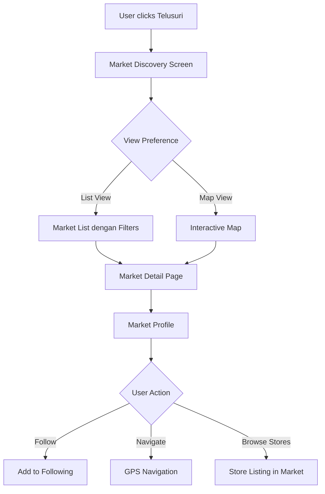

# Missing Features - Telusuri Pasar & Guest Mode

## Overview
Dokumentasi untuk fitur-fitur yang perlu ditambahkan berdasarkan analisis flowchart "Jelajah Pasar" untuk memastikan 100% kesesuaian.

## 1. Telusuri Pasar Feature

### Design Specifications

#### Screen Layout
```
Header:
├── Title: "Telusuri Pasar"
├── Location indicator: Current city/area
├── Search bar: "Cari pasar, toko, produk..."
└── Filter icon: Category, distance, rating filters

Content Area:
├── Map View Toggle: Switch between list dan map view
├── Featured Markets: Highlighted popular markets
├── Nearby Markets: Distance-based sorting
├── Categories: Browse by product categories
├── Market Cards: Individual market information
└── Load More: Pagination untuk large datasets
```

#### Market Card Component
```
Market Card:
├── Market Image: Photo atau representative image
├── Market Name: "Pasar Malang" example
├── Distance: "2.3 km dari lokasi Anda"
├── Rating: Star rating dengan review count
├── Operating Hours: "06:00 - 17:00"
├── Popular Products: "Sayuran, Buah, Daging"
├── Seller Count: "150+ pedagang"
└── Quick Actions: [Navigate], [Follow], [Info]
```

### Interactive Features

#### Map Integration
```javascript
const mapFeatures = {
  googleMaps: {
    markers: 'Market locations dengan custom icons',
    clustering: 'Group nearby markets when zoomed out',
    directions: 'Navigate to selected market',
    streetView: 'Virtual market tour'
  },
  filters: {
    distance: '1km, 5km, 10km, Semua',
    category: 'Sayuran, Buah, Daging, Bumbu, dll',
    rating: 'Minimum rating filter',
    openNow: 'Show only currently open markets'
  },
  search: {
    autoComplete: 'Market name suggestions',
    voiceSearch: 'Voice input untuk search',
    recentSearches: 'Save dan display recent searches',
    popularSearches: 'Trending market searches'
  }
};
```

#### Navigation Integration
```
Bottom Navigation Update:
├── Home (existing)
├── Trends (existing)  
├── Telusuri (NEW) ← Add this
├── Chat (existing)
├── Recommendations (existing)
└── Profile (existing)

Alternative: Add as Home Quick Action
├── Current: "Tren Pasar" & "Chat AI"
├── Add: "Telusuri Pasar" sebagai 3rd quick action
└── Make it 3-grid layout instead of 2-grid
```

### User Experience Flow


## 2. Guest Mode Implementation

### Authentication Flow Update

#### Login Screen Enhancement
```
Login Screen Updates:
├── Existing: Email/Username input
├── Existing: Password input
├── Existing: Login button
├── ADD: "Lanjutkan sebagai Tamu" button
├── Existing: Registration link
└── Existing: Terms notice
```

#### Guest Mode Limitations
```javascript
const guestModeFeatures = {
  allowed: [
    'Browse markets dan stores',
    'View products dan prices', 
    'Read news feed',
    'Use basic search',
    'View public profiles',
    'Access telusuri pasar'
  ],
  restricted: [
    'AI chat assistant',
    'Personal recommendations',
    'Social features (follow/followers)',
    'Shopping lists dan wishlist',
    'Price alerts',
    'Bookmark stores',
    'Chat dengan penjual'
  ],
  conversion: [
    'Persistent registration prompts',
    'Feature unlock previews',
    'Benefits of registration messaging',
    'One-click registration dari guest mode'
  ]
};
```

### Guest UI/UX Design

#### Navigation Adaptation
```
Guest Bottom Navigation:
├── Home ✅ (limited content)
├── Trends ✅ (public data only)
├── Telusuri ✅ (full access)
├── Login 🔒 (replaces Chat)
├── Register 🔒 (replaces Recommendations)
└── [Profile hidden untuk guest]

Header Updates:
├── Show "Mode Tamu" indicator
├── Add "Daftar Sekarang" CTA button
└── Guest-specific welcome message
```

#### Conversion Strategy
```
Guest to User Conversion:
├── Strategic placement of "Unlock Feature" CTAs
├── Feature preview dengan registration prompt
├── Limited usage notifications
├── Progress indicator: "3 more views before registration required"
├── Social proof: "Join 10,000+ pengguna terdaftar"
└── Benefit messaging: "Get personalized recommendations"
```

## 3. Enhanced Economic News Section

### Content Structure

#### News Categories
```
Economic News Categories:
├── Harga Komoditas: Daily commodity price updates
├── Inflasi & Ekonomi: National economic indicators
├── Kebijakan Pemerintah: Government policy affecting markets
├── Cuaca & Pertanian: Weather impact on agriculture
├── Global Markets: International market effects
├── Regional Updates: Local market-specific news
└── Analisis Ahli: Expert economic analysis
```

#### News Card Enhancement
```
Enhanced News Card:
├── Category Tag: Color-coded news category
├── Headline: Clear, concise title
├── Summary: 2-3 sentence preview
├── Impact Indicator: "Berpengaruh pada: Sayuran, Buah"
├── Price Movement: "↑ Naik 5%" atau "↓ Turun 2%"
├── Source: News source credibility
├── Timestamp: Publication time
├── Reading Time: "3 min read"
├── Related Products: Affected product categories
└── AI Insight: "Prediksi dampak harga minggu depan"
```

### AI Integration with News

#### Smart News Processing
```javascript
const newsAIFeatures = {
  contentAnalysis: {
    sentimentAnalysis: 'Positive/negative market sentiment',
    priceImpactPrediction: 'Predict price changes dari news',
    relevanceScoring: 'Personalized news relevance',
    summaryGeneration: 'Auto-generated news summaries'
  },
  userPersonalization: {
    categoryPreferences: 'Learn user interests',
    locationRelevance: 'Local market news priority',
    productTracking: 'News about followed products',
    alertGeneration: 'Important news notifications'
  },
  marketCorrelation: {
    priceCorrelation: 'News impact on actual prices',
    historicalAnalysis: 'Past news impact patterns',
    predictionAccuracy: 'Track AI prediction success',
    marketTiming: 'Optimal buying/selling timing'
  }
};
```

## Implementation Priority

### Phase 1: Critical Features (Week 1-2)
1. **Telusuri Pasar Basic Implementation**
   - [ ] Create new screen dengan market listing
   - [ ] Add to navigation (6th tab atau home quick action)
   - [ ] Basic search dan filter functionality
   - [ ] Market card component
   - [ ] Integration dengan existing market data

2. **Guest Mode Core Features**
   - [ ] Add "Lanjutkan sebagai Tamu" button to login
   - [ ] Create guest user state management  
   - [ ] Implement feature restrictions untuk guest
   - [ ] Design guest-specific navigation
   - [ ] Add registration conversion prompts

### Phase 2: Enhanced Features (Week 3-4)
3. **Map Integration untuk Telusuri Pasar**
   - [ ] Google Maps integration
   - [ ] Market location markers
   - [ ] GPS navigation functionality
   - [ ] Distance calculations
   - [ ] Map/list view toggle

4. **Enhanced Economic News**
   - [ ] Category-based news filtering
   - [ ] AI-powered news analysis
   - [ ] Price impact indicators
   - [ ] News personalization
   - [ ] Economic indicators dashboard

### Phase 3: Advanced Features (Week 5-6)
5. **Guest Experience Optimization**
   - [ ] Smart conversion timing
   - [ ] Feature preview system
   - [ ] Guest analytics tracking
   - [ ] A/B test conversion strategies
   - [ ] Guest retention improvements

6. **Market Discovery Enhancement**
   - [ ] Advanced filtering options
   - [ ] Market ratings dan reviews
   - [ ] Social features (popular markets)
   - [ ] Market event notifications
   - [ ] Store discovery within markets

## Success Metrics

### Telusuri Pasar KPIs
- Market discovery usage rate
- User engagement dengan market profiles
- Navigation to markets (GPS usage)
- Market following/bookmarking rates
- Time spent exploring markets

### Guest Mode KPIs  
- Guest to registered user conversion rate
- Guest session duration
- Feature restriction engagement
- Registration prompt effectiveness
- Guest retention rate

### Economic News KPIs
- News engagement rates
- Price prediction accuracy
- User action after reading news
- News sharing rates
- AI insight relevance ratings

## Integration with Existing Features

### Enhanced AI Assistant
```
Telusuri Pasar + AI Integration:
├── "Cari pasar terdekat dengan sayuran segar"
├── "Rekomendasi pasar untuk belanja mingguan"
├── "Market populer untuk produk organik"
└── "Bandingkan harga pasar A vs pasar B"

Economic News + AI Integration:
├── "Jelaskan dampak berita ini pada harga cabai"
├── "Kapan waktu terbaik beli berdasarkan berita ini?"
├── "Produk apa yang terpengaruh berita inflasi?"
└── "Prediksi harga berdasarkan cuaca dan berita"
```

### Social Features Integration
```
Telusuri Pasar + Social:
├── Follow favorite markets
├── Share market discoveries
├── Community market reviews
└── Market check-ins dan photos

Guest Mode + Social:
├── View public market reviews
├── See popular markets without following
├── Access community content (read-only)
└── Preview social features untuk conversion
```
